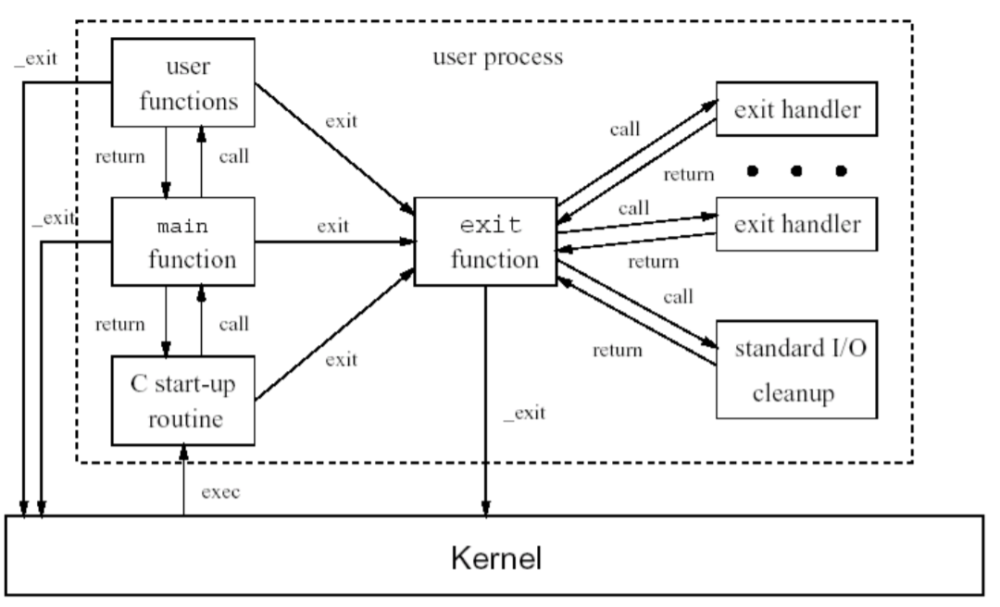

# Process
- program = 실행파일.
- process = 실행 중인 program.
- UNIX의 초창기에는 실행과 Scheduling의 기본 단위였다. <br>
(thread가 이를 대체함.)
- process에는 총 3개의 ID가 존재한다.
  - Real USER ID : 실제로 해당 program을 실행시킨 사용자 ID
  - EFFECTIVE USER ID : PERMISSION을 check할 때 사용하는 ID 일반적으로 REAL과 동일.
  - SAVED SET USER ID : 특정 File에 open하는 USER에게 특정 권한을 부여할 수 있도록 ID를 SETTING함.

### 1. process 생성
- UNIX에서 process를 생성하는 방법은 자신과 똑같은 process를 하나 더 만드는 것이다.
- 그 이유는 만들어진 process는 대부분의 경우 parent process의 자원을 그대로 사용하여 추가적인 동을 수행하기 때문이다.
- 이렇게 생성된 process는 parent process와 독립적이다.(deep copy)
- 어떤 process가 먼저 실행될 지는 알 수 없다.

```c
#include <stdio.h>
#include <sys/types.h>
#include <unistd.h>

pid_t fork(void);
// 자신과 똑같은 process하나를 생성한다.

void main() {
  int pid;
  if ((pid = fork()) == 0) {
    // 자식 process는 pid가 0으로 return된다.  
  }
  else if (pid > 0) {
    // 부모 process에게는 자식 process의 pid가 return된다.  
  }

  // if와 else 이후의 부분은 두 개의 process모두 실행 시켜서 두 번 실행된다.
  // 이를 방지하고 싶다면, 자식 process를 반드시 종료시켜줘야 한다.
}
```

### 2. process 종료
- process의 종료 시나리오는 3가지가 있다.
  - 1) main function의 return
  - 2) exit의 호출
  - 3) \_exit의 호출

  

- process는 종료될 때, exit handler와 standard I/O를 clean up해주어야한다.
- 그 이후에 \_exit를 통해 최종 종료하게 되는데 exit없이 \_exit을 바로 호출하면 문제가 발생한다.

```c
#include <stdlib.h>

void exit(int status);
// process를 종료합니다.
// 이때, 통념적으로 status가 0이면 정상종료.
// 1이면 비정상종료로 취급합니다.
```

### 3. process 대기
  1) 두 개 이상의 process가 critical section에 접근하는 경우 process는 대기해야 한다.
  2) process간의 synchronized task를 수행해야한다면, <br>
하나의 process는 다른 process가 끝나기를 기다려야 한다. <br>
  3) process간의 의존성이 있는 경우 다음과 같은 동작을 수행한다.<br>
ex) 다른 process의 결과물이 필요한 경우

```c
#include <sys/types.h>
#include <sys/wait.h>

pid_t wait(int *statloc);
// 자신의 child process가 끝나기를 기다린다.
// 자식이 여러 명이라면 제대로 동작하기 어렵다.
// statloc를 통해서 process의 return값을 받을 수 있다.
// process의 return값은 exit(num)의 num 값을 전달받는다.

pid_t waitpid(pid_t pid, int *statloc, int options);
// 특정 process의 동작이 끝나기를 기다린다.
```

### 4. process 실행
- 현재 실행 중인 program을 갈아치우고, 새로운 program을 실행시킨다.
- process에서 자신은 그대로 유지한 채, <br>
다른 program을 실행시키고 싶다면, 다음과 같은 절차를 시행해야 한다. <br>
  1) process 하나를 fork한다. <br>
  2) fork한 process에서 다른 program을 실행시킨다.
- 매우 비효율적으로 보이지만, Linux에서는 이 형식을 따른다.

```c
#include <unistd.h>

/* --------------------basic exec-----------------------------*/
int execl(char *pathname, char *arg0, char *arg1, ..., (char *) 0);
// 실행할 filename까지 지정해주고, 거기서 모든 arg를 전달해주어야 한다.
// ex. execl("/home/lsp41/mycp", "mycp", "file1", "file2", NULL);

int execv(char *pathname, char *argv[]);
// vector를 전달할 때에도 배열의 마지막 원소에 NULL을 추가해주어야 한다.

/* --------------------send environment exec-----------------------------*/
int execle(char *pathname, char *arg0, char *arg1, ..., (char *)0, char *envp[]);
int execve(char *pathname, char *argv[], char *envp[]);
// 인자의 환경 값을 추가적으로 전달하는 방식이다.


/* ----------------environment variable based exec--------------------*/
int execlp(char *filename, char *arg0, char *arg1, ... , (char *)0);
int execvp(char *filename, char *argv[]);
// path를 찾을 때, 환경 변수를 바탕으로 file을 찾는다.
// ex. execvp("ls", "ls", "-al", NULL);
```
- RETURN
  - OK = no(because execution)
  - NOT = -1

```c
#include <stdlib.h>
#include <stdio.h>

int system(char *cmdstring);
// terminal 창에서 실행시키는 command를 입력하면 해당 명령어를 실행시켜 준다.
// 이거는 fork, exec and waitpid를 통해서 구현이 가능하다.
```
-RETURN
  - OK = termination status
  - NOT = -1


# Thread
- light weight process
- process 내에서 자원을 공유하면서 각자 기능을 수행한다.(code segment, static data)
- process의 전체 process의 복제를 통한 process의 생성은 overhead가 너무 크기 때문에, <br>
thread라는 방식이 고안되었다.
- main thread가 종료되면 모든 thread가 종료된다는 것을 유의하자.<br>
(process는 그러지 않음.)
- 여기서 공유하지 않고, 추가로 필요한 자원이 있다.(PC, Stack 공간, 등)
- 컴파일 시에는 반드시 -lpthread를 라이브러리에 추가해주어야 한다.

### thread 생성
- thread를 생성할 때는 특정 함수를 지정하고 해당하는 함수를 실행시키는 형태로 생성한다.
- 이때, thread간에는 우선 순위가 없고 누가 먼저 실행될 지는 알 수 없다.

```c
#include <pthread.h>

int pthread_create(pthread_t *tid, pthread_attr_t attr, (void *)function, void* arg);
// 반드시 하나의 arg만 보낼 수 있다.
// 여러 개 보내고 싶다면 구조체를 이용하는 것이 좋겠다.
// ex. pthread_create(&tid, NULL, (void *)thread1, (void *)"hello");


//void *는 null pointer처럼 아무것도 없다는 뜻이 아닌 무엇이든 될 수 있는 pointer라는 뜻이다.
void *thread1 (void *arg){
  static int value = 3;

  return (void *)&value;
  // 값을 return 해줄 때는 void*로 반드시 반환해서 return해야 한다.
  // return 하는 값은 pointer를 return 하기 때문에 항상 사라질 위험이 있는 위험이 있다.
  // 따라서, 원하는 결과를 얻기 위해서는 static variable 또는 global variable을 사용해야 한다.
}
```

### thread 종료
- thread를 종료할 때 exit를 실행시키면 당연히 process가 끝나버린다.

```c
#include <pthread.h>

void pthread_exit(void *retval);

```

### thread 대기
- thread를 대기하고, 해당 thread의 return value를 얻어옵니다.

```c
#include <pthread.h>


int pthread_join(pthread_t tid, void **thread_return);
// thread_return을 통해서 기다린 thread의 return value를 전달 받을 수 있다.
// 이때 전달되는 형태는 **이므로 이를 제대로 받기 위해서는 * 변수를 선언하고 이것의 주소로 받는 것이 적당하다.
// ex. void * a;
//     pthread_join(tid, &a);
//     printf("%d", *(int *)a);
```
