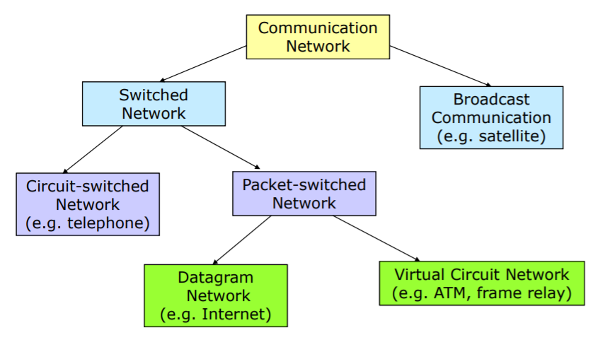
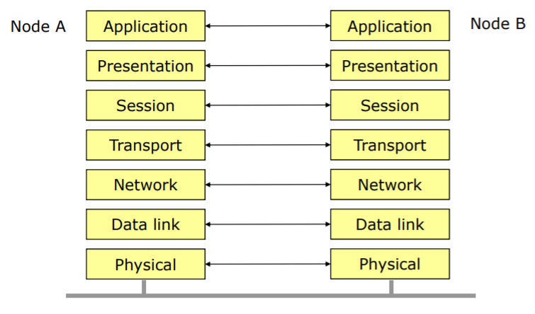
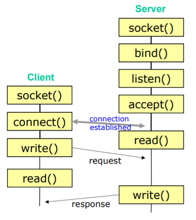
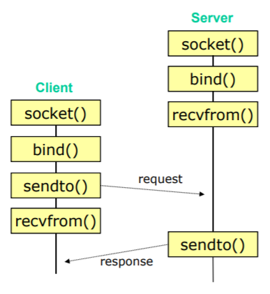

# Sockets


### Base
- Communication network



  - network 통신의 종류는 크게 2개로 나뉜다.
  - 하나는 위성을 이용한 Broadcasting 방식과 Switch를 통해 대상을 찾아가는 방식이 있다.
  - 위성을 통한 방식을 제약 조건이 존재하고, 그 외에는 방법이 발견된 것이 아직까지 없다.
    - Switch방식은 다시 circuit switched와 packet switched로 나뉜다.
    - circuit은 하나 연결을 유지하면서 동일한 길로만 통신을 주고받는 방식이다.
    - packet은 매번 통신이 필요한 시점마다 하나씩 보내는 방식이다.
      - 여기서 packet switched는 또 2개로 나뉜다.
      - datagram 방식은 매 순간마다 packet을 보내는 경로가 유동적으로 변화하면, 어떻게든 host에 도달하는 것이 목적이다.
      - virtual circuit 방식은 packet방식에서 일정한 route를 확정하고 그 길로 통행하는 방식이다. 일정한 품질을 요구하는 경우 사용되곤 한다.

- OSI 7 Layor



  1. Physical layor : 물리적인 연결을 책임지는 계층이다. 유선 / 무선 / 광섬유 등
  2. Data link layor : Physical layor를 통해 서로 연결된 두 node간의 통신을 관리한다.(mac)
  3. Network layor : Data link layor로 연결된 여러 노드 간의 network에서 특정 host를 찾는다.(ip)
  4. Transport layor : 연결된 두 host에서 데이터가 제대로 전달됐는지를 점검하고, 각 host의 어떤 process에서의 요청인지를 파악한다.(port)
  5. (~7)Application layor : 현대에 와서는 5부터 7계층까지의 경계가 매우 흐릿해졌다. 그래서 이를 통합하여 Application layor로 정의한다. 전달 or 전송할 데이터를 어떻게 접근하고 보여줄지를 정한다.

- 이렇게 계층을 나눔으로서 빠르지는 않지만, 오류를 쉽게 찾을 수 있는 형태를 구성하게 되었다.
- 최근에 와서는 무조건 속도만을 위해 osi layor를 허물고는 한다.

### TCP


- socket 통신으로 tcp의 경우에는 연결을 유지하며 통신을 주고받는 형태이다.
- 연결을 진행하기 위해 3 way hand-shaking을 수행한다.(syn, syn + ack, ack)
- 상당히 신뢰성이 높고 패킷 손실과 같은 일이 발생하지 않게 해주지만, overhead로 인한 속도 저하가 크다.
```c
#include <sys/types.h>
#include <sys/socket.h>
#include <netinet/in.h>

// socket을 생성하여 socket id를 return
// 후에 return한 socket id를 통해 socket을 찾는다.
// TCP인 경우, family = PF_INET / type = SOCK_STREAM / protocol은 0으로 사용한다.
int socket(int family, int type, int protocol);

// socket binding할 때, 실제로 입력되는 형태의 구조체
struct sockaddr {
  u_short sa_family;
  char sa_data[14];
}

// 사용자가 입력하기 쉽도록 만들어 놓은 구조체
// 이를 통해 입력하고, sockaddr로 변형하여 사용한다.
struct sockaddr_in {
  short sin_family; // family를 묻는 내용으로 PF_INET으로 고정이라고 보면된다.
  u_short sin_port; // port번호를 입력하는 부분, 주의할점은 cpu가 intel인 경우 endian 변환해야함.
  struct in_addr sin_addr; // ip를 입력하는 부분 실제로는 in_addr이라는 구조체에 입력하는 방식이다.
  char sin_zero[8]; // 사용하지 않는 부분으로 0으로 모두 채워주어야 한다.
}

// ip address를 표현하는 부분으로 반드시 u_long이 들어오도록 ip입력을 변환해야한다.
// .으로 구분되는 string일 경우 inet_addr을 쓰는 것이 일반적이다.
struct in_addr {
  u_long s_addr;
}

// socket에 address(ip + port)를 연결한다.
int bind(int sd, struct sockaddr *myaddr, int addrlen);

// 특정 address와 sd가 가르키는 socket의 연결을 시도한다.
int connect(int sd, struct sockaddr *servaddr, int addrlen);

// socket을 setting한다.
// 해당 sd의 한 번에 들을 수 있는 요청 수를 의미한다.
int listen(int sd, int backlog);

// connect를 받을 준비를 한다.
// sd가 가르키는 socket을 peer로 부터 요청을 받을 것을 기다리는 상태로 만든다.
// 이때, 구분없이 어떤 사용자든 요청을 받고 싶다면
// 처음 socket address를 입력할 때, INADDR_ANY로 설정하자.
int accept(int sd, struct sockaddr *peer, int *addrlen);

// sd와 연결된 socket에게 buffer의 내용을 전송.
ssize_t send(int sd, void *buf, size_t nbytes, int flags);

// sd에 연결된 socket으로 부터 전송받을 때까지 대기하다가 입력을 받는다.
ssize_t recv(int sd, void *buf, size_t nbytes, int flags);

// socket 연결을 종료한다.
int close(int sd);
```

### UDP

- 비연결 방식 통신이다.
- 패킷 손실에 대해서 아무것도 책임지지 않는 만큼 overhead가 없기 때문에 속도가 빠르다.
- tcp와 다른 점은 비연결인 만큼 connect와 accept단계가 없고, receive와 send방식이 서로 다르다.

```c
// 현재 지정한 socket에 buf의 내용을 전송한다.
// flags는 보통 0으로 두는 것이 일반적이다.
// 전송할 대상을 지정하여 data를 전송한다. 이때 모두를 대상으로 하여 Broadcasting도 가능하다.
ssize_t sendto(int sd, void *buf, size_t nbytes, int flags,struct sockaddr *to, int *addrlen);

// 입력을 받을 대상을 지정하여 data를 받아온다. 이때 모두를 대상으로 하여 Broadcasting도 가능하다.
ssize_t recvfrom(int sd, void *buf, size_t nbytes, int flags, struct sockaddr *from, int *addrlen);
```

### Endian
- integer를 저장할 때, 위에 값부터 저장하는 big-endian 방식과 반대로 저장하는 little-endian 방식이 있다.
- 통신 시에 표준은 big-endian을 통해 수행을 하는데, 만약 little-endian을 쓰는 방식이면, 이를 거꾸로 바꿔주는 과정이 필요하다.


### DNS
- DNS Server에 ip주소 번역을 의뢰할 수 있다.
```c
#include <netdb.h>

// DNS Server name을 hostent라는 형태의 구조체로 return 한다.

struct hostent *gethostbyname(char *name);

struct hostent {
  char *h_name;
  char **h_aliases;
  int h_addrtype;
  int h_length; // address의 길이
  char *h_addr_list;

#define h_addr h_addr_list[0] // struct

//hp->h_addr를 copy해서 sock_addr_in.sin_addr에 입력하는 게 일반적이다.
}
```
